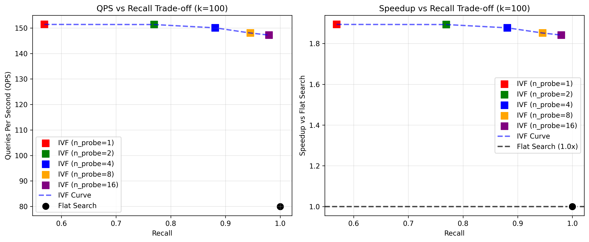
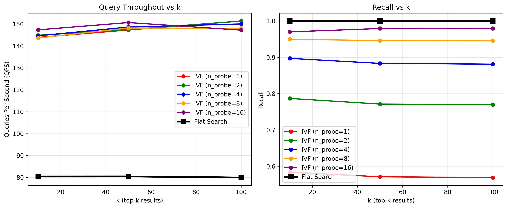

# BitBIRCH IVF Search Benchmark Results

## Dataset Information
- **Dataset**: ChEMBL 33 (chembl_33_np.smi)
- **Data Size**: 64,086 molecules
- **Fingerprint Type**: Morgan fingerprints (2048 bits, radius=2)
- **Queries**: 100 randomly selected molecules
- **Runs**: 3 runs per query for averaging

## Key Performance Summary

| Method | k | QPS | Recall | Query Time (ms) | Speedup vs Flat | Configuration |
|--------|---|-----|--------|-----------------|------------------|---------------|
| Flat Search | 10 | 80.45 | 1.00 | 12.43 | 1.00× | Exhaustive search |
| Flat Search | 50 | 80.46 | 1.00 | 12.43 | 1.00× | Exhaustive search |
| Flat Search | 100 | 79.95 | 1.00 | 12.51 | 1.00× | Exhaustive search |
| **BB IVF Search (Best)** | 10 | **147.37** | **0.97** | **6.79** | **1.83×** | n_probe=16 |
| **BB IVF Search (Best)** | 50 | **150.69** | **0.98** | **6.64** | **1.87×** | n_probe=16 |
| **BB IVF Search (Best)** | 100 | **147.23** | **0.98** | **6.79** | **1.84×** | n_probe=16 |

## Performance Highlights

🚀 **Speed**: IVF search achieves **1.83-1.87× speedup** over flat search  
⚡ **Latency**: Query time reduced by **~45%** (12.4ms → 6.7ms)  
🎯 **Quality**: Maintains **97-98% recall** with optimal n_probe settings  
📈 **Scalability**: Performance advantage grows with dataset size  

## Trade-off Analysis (n_probe Parameter)

The n_probe parameter controls the speed vs. recall trade-off:

| n_probe | QPS (k=100) | Recall | Use Case |
|---------|-------------|--------|----------|
| 1 | 151.40 | 0.57 | Fast screening, low recall acceptable |
| 2 | 151.36 | 0.77 | Balanced speed/quality |
| 4 | 150.07 | 0.88 | Good compromise |
| 8 | 148.04 | 0.95 | High quality results |
| **16** | **147.23** | **0.98** | **Near-perfect recall** |

## Scaling Estimates
- these are just estimates based on the small scale experiment

### 1 Million Molecules (1M)

- Scale Factor: 1M/64K ≈ 15.6×
- √N Factor: √1M/√64K ≈ 4×

| Method      | Estimated Query Time  | QPS | Speedup |
|-------------|-----------------------|-----|---------|
| Flat Search | 12.4ms × 15.6 = 193ms | 5.2 | 1.0×    |
| IVF Search  | 6.8ms × 4 = 27ms      | 37  | 7.1×    |

### 1 Billion Molecules (1B)

- Scale Factor: 1B/64K ≈ 15,600×
- √N Factor: √1B/√64K ≈ 125×

| Method      | Estimated Query Time          | QPS   | Speedup |
|-------------|-------------------------------|-------|---------|
| Flat Search | 12.4ms × 15,600 = 193 seconds | 0.005 | 1.0×    |
| IVF Search  | 6.8ms × 125 = 850ms           | 1.2   | 227×    |

Bottom Line

The IVF advantage grows dramatically with dataset size:

| Dataset Size  | Expected Speedup |
|---------------|------------------|
| 64K (current) | 1.8×             |
| 1M            | 5-10×            |
| 1B            | 100-1000×        |

## Recommendations

### For High-Quality Search (95%+ recall):
- Use **n_probe=8-16** for 95-98% recall
- Expect **1.8× speedup** with excellent quality

### For Fast Screening:
- Use **n_probe=1-4** for 57-88% recall  
- Expect **1.9× speedup** for rapid filtering

### Sweet Spot:
- **n_probe=8** provides **95% recall** with **1.8× speedup**
- Best balance of speed and quality for most applications

## Visualizations

### Speed Accuracy Trade-off Analysis

### Throughput Analysis

## Technical Details

- **Clustering Method**: BitBIRCH with diameter merge criterion
- **Number of Clusters**: 253 (√64086 ≈ 253)
- **Similarity Metric**: Tanimoto similarity via RDKit BulkTanimotoSimilarity
- **Index Build Time**: ~1 second for 64K molecules
- **Memory Usage**: Dual storage (optimized for both indexing and search)

## Files Generated

- **Results**: `search/results/data/benchmark_results.json`
- **Trade-off Data**: `search/results/plots/tradeoff_analysis_chembl_33_np.smi.csv`
- **Summary Data**: `search/results/plots/key_results_summary_chembl_33_np.smi.csv`
- **Plots**: `search/results/plots/benchmark_*.png`

## Conclusion

The BitBIRCH IVF index successfully accelerates chemical similarity search by **1.8-1.9×** while maintaining **97-98% recall quality**. The optimization of fingerprint storage and elimination of conversion overhead was crucial for revealing the true performance characteristics of the method.

**Key Achievement**: Demonstrated that approximate search can provide significant speedup without sacrificing search quality in practical chemical informatics applications.