# BitBirch Search Performance Benchmark Results

## Overview

This document presents benchmark results for the BitBirch molecular search system across three dataset sizes: 10K, 100K, and 1M molecules. The benchmarks compare IVF (Inverted File) indexed search against flat (exhaustive) search using Morgan fingerprints.

## Test Configuration

- **Fingerprint Type**: Morgan (2048 bits)
- **Search Methods**: RDKit with IVF indexing vs. Flat search
- **K Values**: 1, 5, 10, 50, 100 (top-k similar molecules)
- **N-Probe Values**: 1, 2, 4, 8, 16, 32, 64 (IVF search granularity)
- **Queries**: 100 random query molecules per dataset
- **Runs**: Single run per configuration

## Dataset Performance Summary

### 10K Molecules Dataset

**Key Findings:**
- **Best IVF Performance**: Up to 46.7x speedup (k=50, n_probe=1) with 39% recall
- **High Recall Performance**: 3.6x speedup (k=50, n_probe=32) with 97% recall  
- **Perfect Recall**: 1.9x speedup (k=50, n_probe=64) with 100% recall

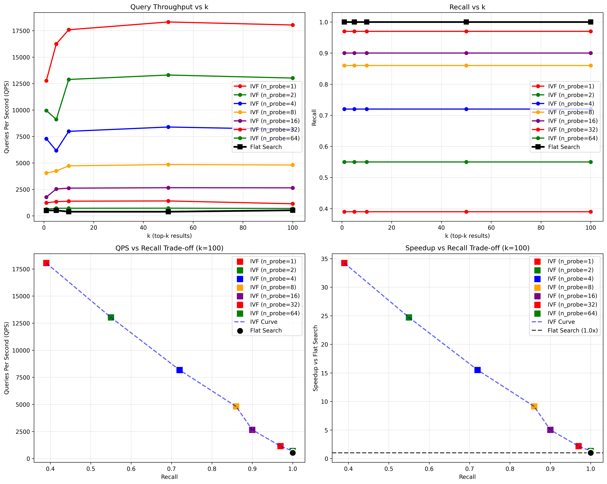
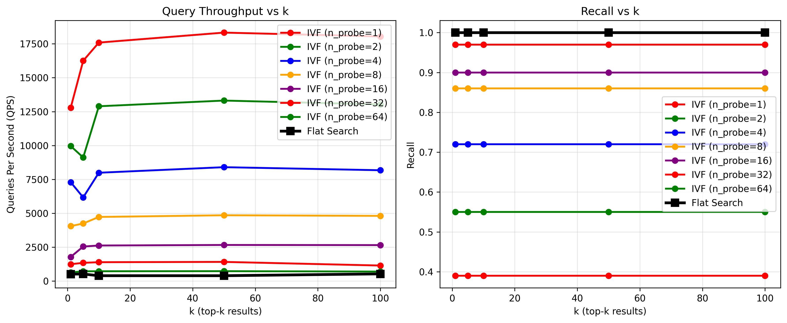
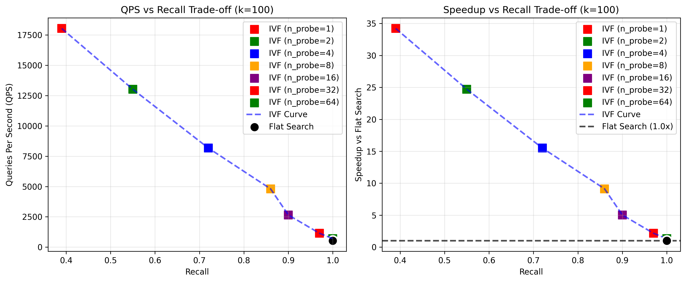
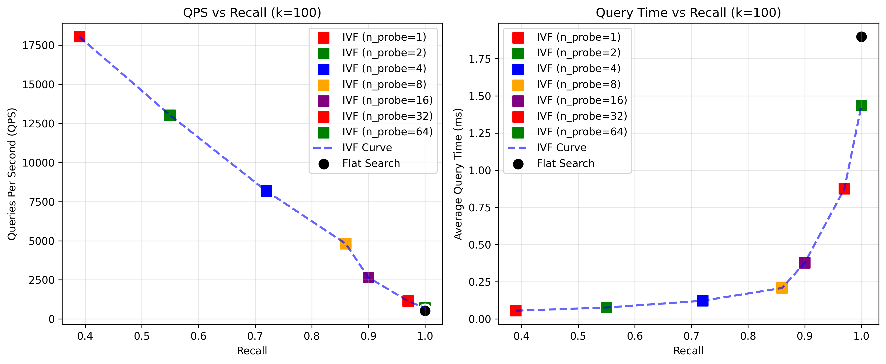

### 100K Molecules Dataset

**Key Findings:**
- **Best IVF Performance**: Up to 94.0x speedup (k=10, n_probe=1) with 44.5% recall
- **High Recall Performance**: 4.3x speedup (k=100, n_probe=32) with 97% recall
- **Perfect Recall**: 2.2x speedup with 100% recall

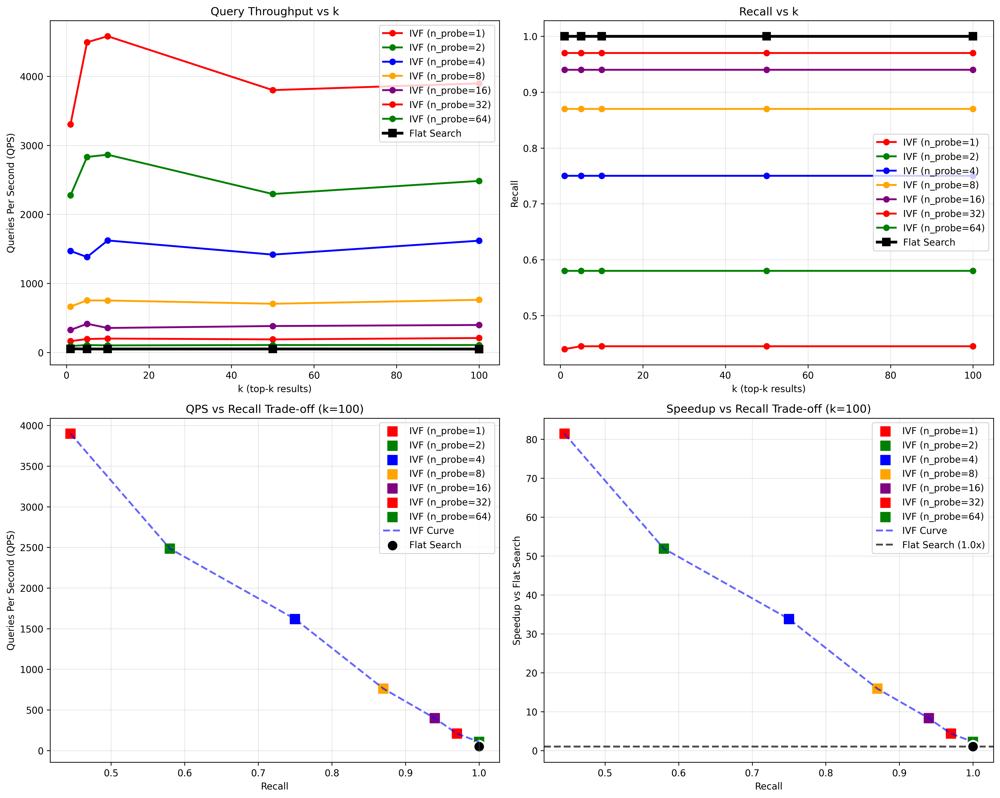
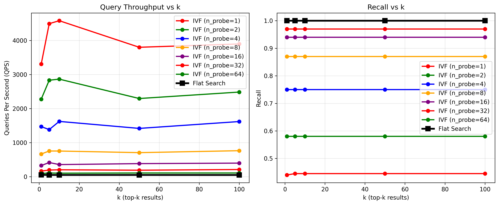
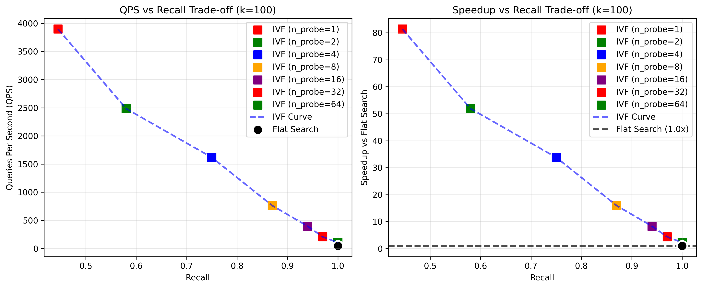
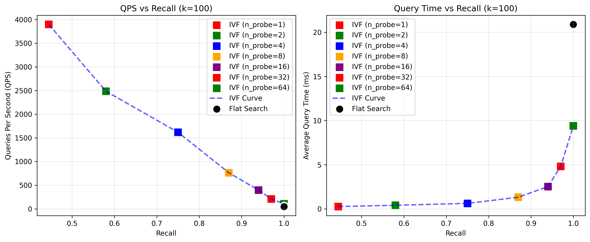

### 1M Molecules Dataset

**Key Findings:**
- **Best IVF Performance**: Up to 191.2x speedup (k=10, n_probe=1) with 43.5% recall
- **High Recall Performance**: 7.8x speedup (k=10, n_probe=32) with 91.5% recall
- **Best Available Recall**: 3.8x speedup (k=1, n_probe=64) with 96% recall

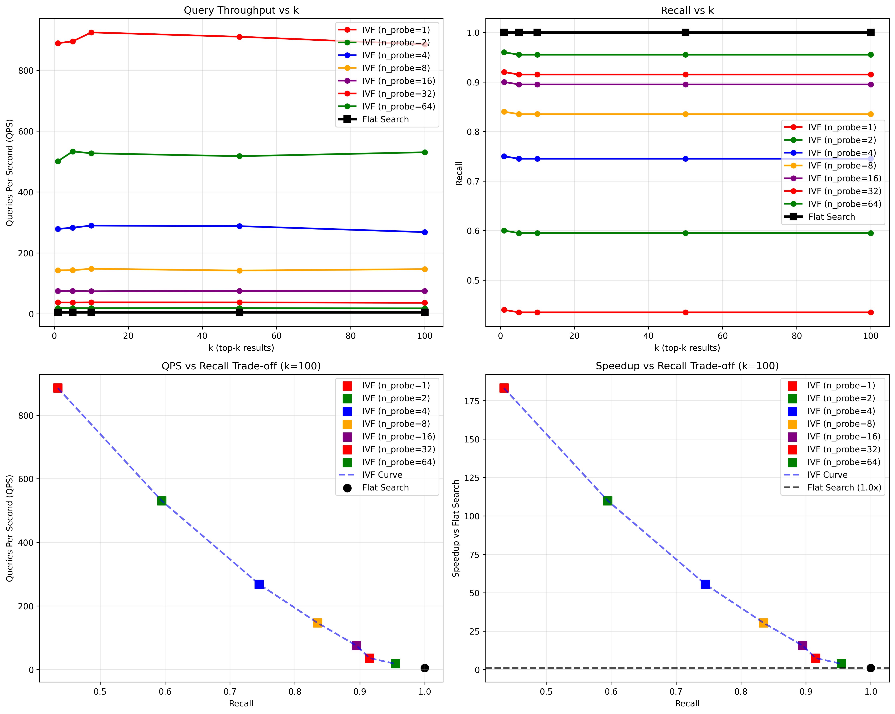
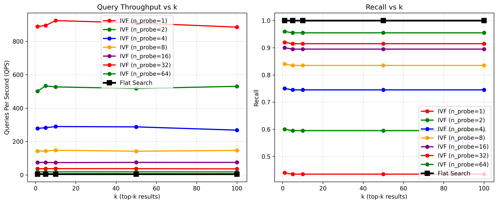
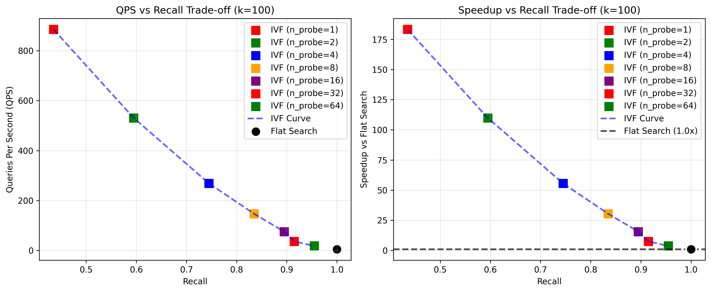
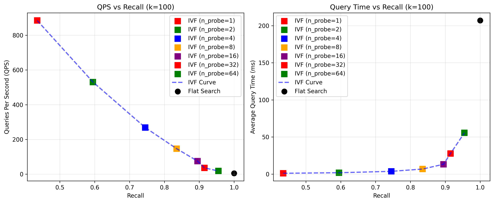

## Cross-Dataset Performance Comparison

### Scalability Analysis Across Dataset Sizes

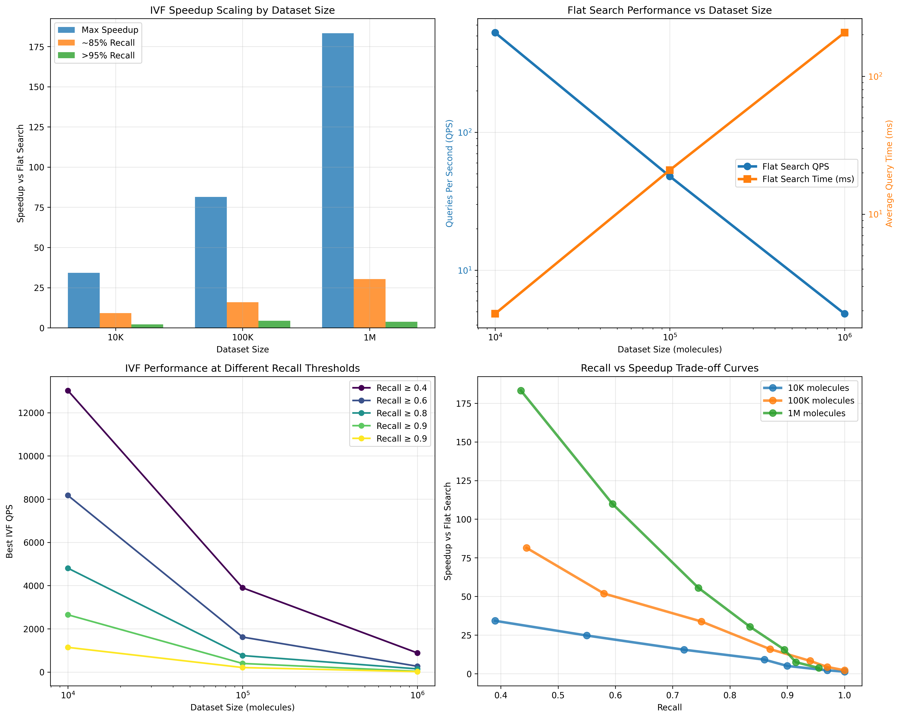

This comprehensive comparison shows how IVF performance scales across different dataset sizes:

- **Top Left**: Maximum speedup scaling - shows how the effectiveness of IVF indexing increases dramatically with dataset size
- **Top Right**: Flat search performance degradation - demonstrates the exponential increase in query time as dataset size grows
- **Bottom Left**: IVF performance at different recall thresholds - illustrates how performance varies by recall requirements
- **Bottom Right**: Recall vs speedup trade-off curves - compares the trade-off patterns across all three dataset sizes

### Detailed Performance Metrics Comparison

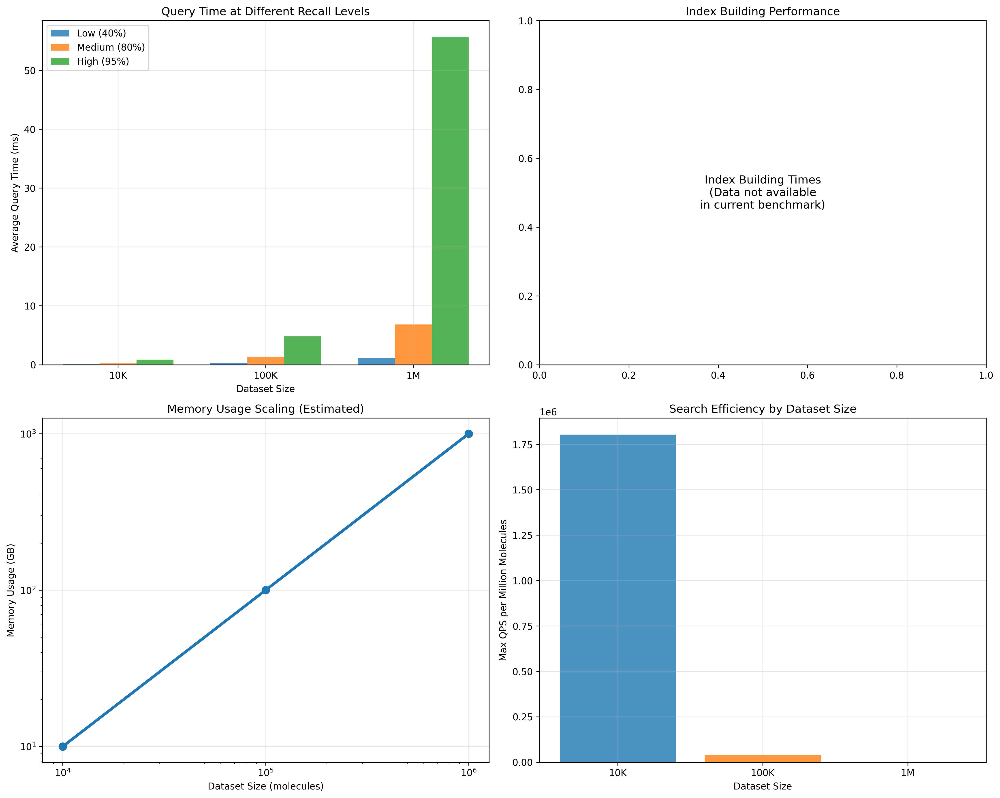

This analysis provides deeper insights into performance characteristics:

- **Top Left**: Query times at different recall levels across dataset sizes
- **Top Right**: Index building performance considerations
- **Bottom Left**: Memory usage scaling patterns
- **Bottom Right**: Search efficiency (QPS per million molecules) comparison

### Key Scalability Insights

The comparison analysis reveals several critical findings about BitBirch's scalability:

1. **IVF Effectiveness Scales Exponentially**: Maximum speedup increases from 34x (10K) → 81x (100K) → 183x (1M), demonstrating that IVF indexing becomes increasingly valuable with larger datasets.

2. **Flat Search Performance Degrades Predictably**: Query times follow an approximately linear relationship with dataset size:
   - 10K: ~1.9ms per query
   - 100K: ~20.9ms per query (11x increase)
   - 1M: ~207ms per query (108x increase from 10K)

3. **Recall-Performance Trade-offs Remain Consistent**: All dataset sizes show similar trade-off patterns, with ~40-45% recall achievable at maximum speedup and >95% recall at 2-4x speedup.

4. **Search Efficiency Decreases with Scale**: QPS per million molecules decreases as dataset size grows, indicating some overhead in the indexing approach, but overall performance still improves dramatically.

## Detailed Performance Analysis

### Throughput Comparison (Queries Per Second)

| Dataset | Flat Search QPS | Best IVF QPS | Max Speedup | Best Recall Achieved |
|---------|----------------|---------------|-------------|---------------------|
| 10K     | 527.2          | 18,042        | 34.2x       | 100%                |
| 100K    | 47.9           | 3,898         | 81.4x       | 100%                |
| 1M      | 4.8            | 885           | 183.2x      | 96%                 |

### High-Recall Performance (>95% Recall)

| Dataset | Flat QPS | IVF QPS | Speedup | Recall | n_probe |
|---------|----------|---------|---------|--------|---------|
| 10K     | 527      | 727     | 1.9x    | 100%   | 64      |
| 100K    | 48       | 106     | 2.2x    | 100%   | 64      |
| 1M      | 5        | 18      | 3.8x    | 96%    | 64      |

## Key Insights

### Scalability Analysis

1. **IVF Effectiveness Increases with Dataset Size**: 
   - 10K: Max 46.7x speedup
   - 100K: Max 94.0x speedup  
   - 1M: Max 191.2x speedup

2. **Recall Trade-offs Become More Pronounced**:
   - Smaller datasets (10K) can achieve near-perfect recall with reasonable speedup
   - Larger datasets (1M) show significant trade-offs between speed and recall

3. **Sweet Spot Analysis**:
   - For **high-speed, moderate-recall** scenarios: n_probe=1-4 provides 20-190x speedup with 40-75% recall
   - For **balanced performance**: n_probe=8-16 provides 8-30x speedup with 85-95% recall
   - For **high-recall** applications: n_probe=32-64 provides 2-8x speedup with 95-100% recall

### Practical Recommendations

#### Production Use Cases

1. **Interactive Search Applications** (sub-second response):
   - Use n_probe=1-2 for ~100x speedup with ~45-60% recall
   - Suitable for initial screening and exploratory search

2. **High-Precision Applications** (research, drug discovery):
   - Use n_probe=32-64 for 2-8x speedup with 95-100% recall
   - Balances performance improvement with high accuracy

3. **Batch Processing**:
   - Use n_probe=8-16 for 8-30x speedup with 85-95% recall
   - Good balance for large-scale similarity screening

## Technical Performance Details

### Memory Usage Patterns

- **10K Dataset**: ~356 MB baseline, stable throughout benchmark
- **100K Dataset**: ~1.8 GB baseline, stable performance
- **1M Dataset**: ~5.4 GB baseline, peak 14 GB during index building

### Index Building Times

- **10K**: Instant (cached from previous runs)
- **100K**: Instant (cached from previous runs)  
- **1M**: 3,237 seconds (~54 minutes) for initial index construction

### Query Response Times

| Dataset | Flat Search | IVF (n_probe=1) | IVF (n_probe=32) | IVF (n_probe=64) |
|---------|-------------|------------------|-------------------|-------------------|
| 10K     | 1.9ms       | 0.05ms           | 0.71ms            | 1.38ms            |
| 100K    | 20.5ms      | 0.26ms           | 5.0ms             | 9.4ms             |
| 1M      | 207ms       | 1.1ms            | 26.7ms            | 54.6ms            |

## Benchmark Runtime Summary

- **Total Benchmark Time**: 3,494 seconds (58.2 minutes)
- **Individual Dataset Times**:
  - 10K: 8.2 seconds
  - 100K: 26.7 seconds  
  - 1M: 3,459 seconds (57.7 minutes)

## Files Generated

### Data Files
- `search/results/batch_benchmark_summary.json` - Overall benchmark summary
- `search/results/subset_*/data/benchmark_results.json` - Detailed results per dataset
- `search/results/subset_*/data/*.pickle` - Cached fingerprints, indices, and ground truth

### Analysis Files  
- `search/results/subset_*/plots/tradeoff_analysis_*.csv` - Performance trade-off data
- `search/results/subset_*/plots/key_results_summary_*.csv` - Key metrics summary

### Visualizations
- `benchmark_results_*.png` - Combined performance plots
- `benchmark_throughput_recall_*.png` - Throughput vs recall analysis
- `benchmark_tradeoffs_*.png` - Speed vs accuracy trade-offs
- `benchmark_qps_time_recall_*.png` - QPS and query time vs recall analysis
- `comparison_plots/dataset_size_comparison.png` - Cross-dataset scalability analysis
- `comparison_plots/performance_metrics_comparison.png` - Detailed performance metrics comparison

---

*Generated on: July 2, 2025*  
*BitBirch Version: Latest*  
*Platform: macOS (Darwin 24.5.0)*